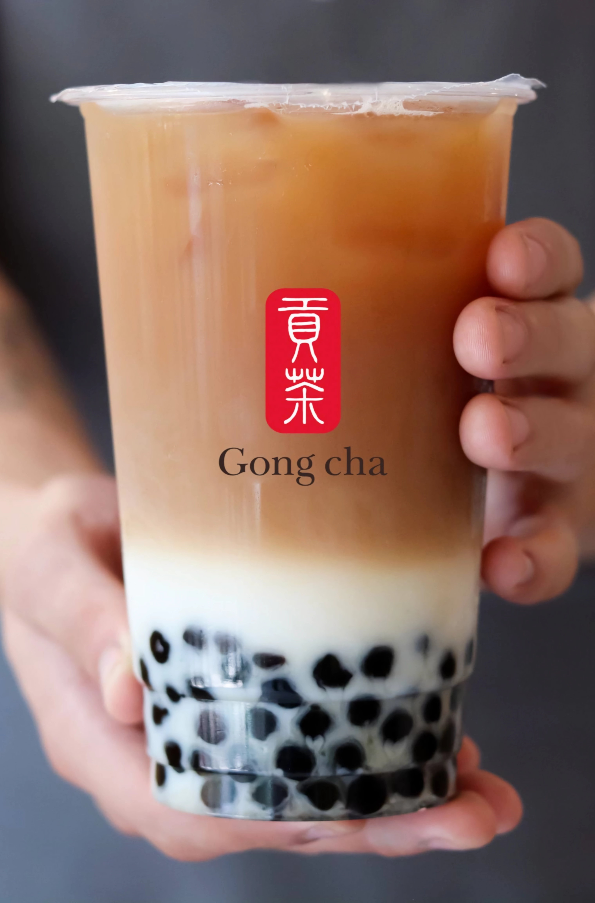

# tapioca.github.io

<!DOCTYPE html>
<html>
<head>
    <meta charset='utf-8'>
    <meta http-equiv='X-UA-Compatible' content='IE=edge'>
    <title>GONG CHA-MAJO Y VIKI</title>
    <meta name='viewport' content='width=device-width, initial-scale=1'>
    <link rel='stylesheet' type='text/css' media='screen' href='CSS/examen-final-estilos.css'>
    
</head>
<body>
    

        <header>
             <nav>
                

                    
                

                

                    <ul>
                        <li class="active"><a href="#">NOSOTROS</a></li>
                        <li><a href="our-history.html">NUESTRA HISTORIA</a></li>
                        <li><a href="menu.html">MENÚ</a></li>
                        <li><a href="https://gongcha.mx/sucursales/">SUCURSALES</a></li>
                        <li><a href="https://gongcha.mx/recompensas/">CLUB GONG CHA</a></li>
                    </ul>
                
  
            </nav>
            <section class="hero">
                 

                        
SE DE LOS PRIMEROS EN PROBAR

                        <h2 class="text-container-title">LA NUEVA BEBIDA SORPRESA</h2>
                        
Creemos haber llegado a la perfección con esta bebida, pero ustedes merecen más que la perfección. Por eso queremos escuchar su opinión ¿Aceptas?

                        <button class="button-text-container">MÁS INFORMACIÓN</button>
                        <button class="button-text-container">REGISTRARME</button>
                

             </section>
            <!-- section -->
            <section class="stats ">
                

                    

                        

                            
2006

                            
ACERCA DE GONG CHA

                        

                    

                    
La marca Gong Cha es conocida por la calidad de sus tés y su servicio.Fundada en 2006 en Kaohsiung, Taiwán; Gong cha se traduce como “Té para el emperador” y es una marca global.
                    

                

                

                    

                        

                            
2009

                            
DE TAIWAN PARA EL MUNDO

                        

                    

                    
En 2009 Gong cha abrió su primera tienda fuera de Taiwán en Hong Kong, el éxito de Gong cha en este país fue muy importante y confirmó la aceptación de la marca fuera de Taiwán.

                    

                

                

                    

                        

                            
2019

                            
GONG CHA EN MÉXICO

                        

                    

                    
En febrero de 2019, Gong cha abrió su primera tienda en México en la ciudad de Guadalajara. A partir del éxito y aceptación, se han tenido más de 80 aperturas.

                

            </section>
        </header>

        

            <section>
                <section class="cards-container">
                    
 
                        
PARA TODOS LOS GUSTOS

                        <h2 class="second-title">LAS BEBIDAS MAS PEDIDAS</h2>
                        
Cada bebida es de una categoría diferente, para poder satisfacer los gustos de todos nuestros clientes.

                    

                        

                            

                                
                                <h3 class="title-card">TAPIOCA BLACK MILK TEA</h3>
                                
Este es uno de los clásicos de Gong cha. Una deliciosa bebida a base de té negro, leche de tu predilección (recuerda que puede ser leche entera, light, de almendras o coco) y deliciosa tapioca negra.

                            

                            

                                
                                <h3 class="title-card">DURAZNO GREEN TEA</h3>
                                
 Si te gustan más las bebidas frescas y a base de agua, esta esta deliciosa bebida a base de green tea que en combinación con nuestro jarabe natural de durazno forman una deliciosa y dulce mezcla.

                            

                            

                                
                                <h3 class="title-card">MILK   COFFEE</h3>
                                
Si lo que buscas es algo que tenga café y que este muy rico esta nuestro delicioso café arábigo traído desde taiwán combinado con un toque de leche, una combinación sin igual.

                            

                            
                            <button class="cards-button"> VER LAS OPINIONES</button>
                        

                       
                    

            </section>

            <section class="main-text-image-container row-reverse">
                

                        
OBTÉN PUNTOS CON TU

                        <h2 class="title-text-image-container club-title">CLUB GONG CHA</h2>
                        
Tus visitas te dan recompensas.   Acumula visitas cada que compras en cualquier sucursal de Gong cha y sube de nivel para más beneficios.   Los niveles que tenemos y sus recompensas son:  
                        <li class="points-li">
BABY MILK FOAM (0-7 visitas al mes): 
Smoothie de cumpleaños, 3% de tus compras en Gong cha Credits,25 Gong cha Credits al recomendar a tus amigos </li>
                        <li class="points-li">
GOLDEN TAPIOCA (8-14 visitas al mes):
 Smoothie de cumpleaños, 5% de tus compras  en Gong cha Credits, 3 toppings gratis al mes, 25 Gong cha Credits al recomendar a tus amigos.</li>
                        <li class="points-li"> 
GONG CHA LOVER (15-31 visitas al mes):
Smoothie de cumpleaños, 8% de tus compras en Gong cha Credits, 5 toppings gratis y 1 cambio de leche al mes, 1 bebida gratis al mes, 25 Gong cha Credits al recomendar a tus amigos.</li>
                       
                    
                

                 

                    
                

            </section>
        </main>
        
        <footer>
            

                

                    <h3 class="footer-cta-heading-title">NUESTRA PROMESA</h3>
                
Nuestro compromiso es preparar el mejor bubble tea.   Desde el primer sorbo lo notarás.

                

            

            

                

                    <h3 class="footer-cta-heading">VENTAJAS DE TENER TU FRANQUICIA</h3>
                    
Si estás buscando una forma de invertir tu dinero y abrir un negocio.   ¡NO LO DUDES MÁS!

                

                

                    <button class="btn-secondary">VER REQUISITOS</button>
                

            

            

                

                    

                        

                            
                        

                        
 
                            
La tapioca mas rica del mundo.

                        

                    

                    

                        

                            
DESCUBRE MÁS

                            <ul>
                                <li>OFICINAS</li>
                                <li>RECLUTAMIENTO</li>
                                <li>PROMOCIONES</li>
                                <li>BLOG</li>
                            </ul>
                        

    
                        

                            <ul>
                                <li>NOTICIAS</li>
                                <li>SUCURSALES</li>
                                <li>FACTURACIÓN</li>
                            </ul>
                        

                    

    
                    

                        

                            
CONTACTOS

                            <ul>
                                <li>
GDL/Puerto Vallarta:
55 885 46600</li>
                                <li>
Resto de la república:
55 885 46665</li>
                            </ul>
                        

                    

                

                
                
                

                    

                        
©️ 2024, All rights reserved 

                    

                    

                        
Developed by María José Navarro and Victoria Camarillo

                    

                

            

            
        </footer>
    

</body>
</html>
